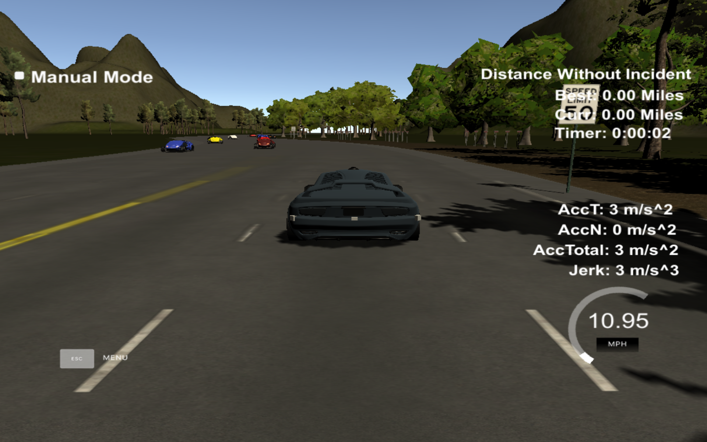
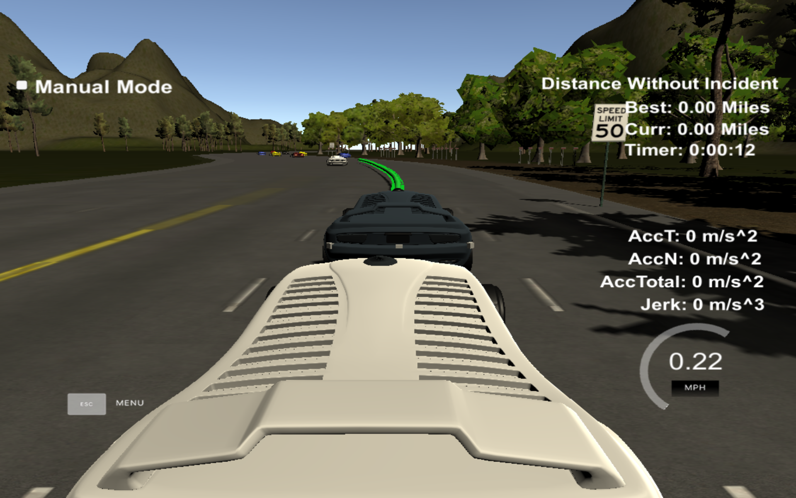

# Path-Planning-Project
Self-Driving Car Engineer Nanodegree Program
   
## Goals
      There are basically 3 main goals of this project
      * Predict the future positions of the all the vehicles within the immediate proximity of our car (ego).
      * Based on the predicted behaviour of other vehicles determine the behviour of our car.
      * Generate the trajectory.
      
      
### NOTE: The solution approach is based on the Project Walk Through (Project Q&A)
   
## Solution Approach

1. We start at lane 1 (center lane) and speed 0.0 mph and accelerate incrementally.
2. Maximum speed is (approximately) limited to 49.8 mph.
3. Prediction:  (lines in the file `main.cpp`from `256` to `304`)

         * First we determine the lane in which our car is driving.
         * The lanes are indicated as follows:
            - Left lane = 0
            - Center lane = 1
            - Right lane = 2
         * Using the data from the sensor fusion, I determine the following
            - Is there a vehicle (approximtely) 30m  ahead of my car?
            - Is there a vehicle on the left and/or right lane either 30m ahead or behind my car?
            
            In other words, I check:
            1. Do I have to slow down?
            2. Can I make a lane change to left lane?
            3. Can I make a lane change to right lane?

4. Behaviour: (lines in the file `main.cpp`from `306` to `319`)

Now, based on the prediction step, I determine the behavior. That is, if there a vehicle ahead of me that I am getting too close to, then I change the lane if possible or else I slow down and then accelerate again within the speed limit (of course).

5. Trajectory generation: (lines in the file `main.cpp`from `327` to `434`)

Now we have the target lane and target speed (or the accelaration) and we need to generate a trajectory for the car to follow.

The idea is to create a list of widely spaced waypoints, evenly spaced at 30m. Later we will interpolate these waypoints with spline and fill it with more points that control the speed.

There are 2 possibilities:

1. If there is no previous trajectory, then I use the car as starting reference.
2. If the previous trajectory has at least 2 points, then I use previous path's end point as reference state

As a next step, I add 3 more points at 30m, 60m and 90m and then shift the car's reference angle to 0 degrees.

Using the C++ spline tool, I interpolate the points to fill in the other waypoints. In total, I use 50 waypoints. We first fill in the points from the previous path and then fill in the remaining ones.

I tried varying the number of waypoints significantly, but having too many points (say 1000) doesn't allow the car to respond quickly to the changes in the surroundings. Even using 100 waypoints had issues while changing lanes.


Few snapshots from the simulator:

1. Begining of the drive



2. Moving to the left lane


3. Moving to the right lane


4. Problematic drive with 1000 waypoints



5. Smooth drive with 50 waypoints after 4.76 miles


## Miscellanious details   

### Simulator.
You can download the Term3 Simulator which contains the Path Planning Project from the [releases tab (https://github.com/udacity/self-driving-car-sim/releases/tag/T3_v1.2).

#### The map of the highway is in data/highway_map.txt
Each waypoint in the list contains  [x,y,s,dx,dy] values. x and y are the waypoint's map coordinate position, the s value is the distance along the road to get to that waypoint in meters, the dx and dy values define the unit normal vector pointing outward of the highway loop.

The highway's waypoints loop around so the frenet s value, distance along the road, goes from 0 to 6945.554.

## Basic Build Instructions

1. Clone this repo.
2. Make a build directory: `mkdir build && cd build`
3. Compile: `cmake .. && make`
4. Run it: `./path_planning`.

Here is the data provided from the Simulator to the C++ Program

#### Main car's localization Data (No Noise)

["x"] The car's x position in map coordinates

["y"] The car's y position in map coordinates

["s"] The car's s position in frenet coordinates

["d"] The car's d position in frenet coordinates

["yaw"] The car's yaw angle in the map

["speed"] The car's speed in MPH

#### Previous path data given to the Planner

//Note: Return the previous list but with processed points removed, can be a nice tool to show how far along
the path has processed since last time. 

["previous_path_x"] The previous list of x points previously given to the simulator

["previous_path_y"] The previous list of y points previously given to the simulator

#### Previous path's end s and d values 

["end_path_s"] The previous list's last point's frenet s value

["end_path_d"] The previous list's last point's frenet d value

#### Sensor Fusion Data, a list of all other car's attributes on the same side of the road. (No Noise)

["sensor_fusion"] A 2d vector of cars and then that car's [car's unique ID, car's x position in map coordinates, car's y position in map coordinates, car's x velocity in m/s, car's y velocity in m/s, car's s position in frenet coordinates, car's d position in frenet coordinates. 

## Details

1. The car uses a perfect controller and will visit every (x,y) point it recieves in the list every .02 seconds. The units for the (x,y) points are in meters and the spacing of the points determines the speed of the car. The vector going from a point to the next point in the list dictates the angle of the car. Acceleration both in the tangential and normal directions is measured along with the jerk, the rate of change of total Acceleration. The (x,y) point paths that the planner recieves should not have a total acceleration that goes over 10 m/s^2, also the jerk should not go over 50 m/s^3. (NOTE: As this is BETA, these requirements might change. Also currently jerk is over a .02 second interval, it would probably be better to average total acceleration over 1 second and measure jerk from that.

2. There will be some latency between the simulator running and the path planner returning a path, with optimized code usually its not very long maybe just 1-3 time steps. During this delay the simulator will continue using points that it was last given, because of this its a good idea to store the last points you have used so you can have a smooth transition. previous_path_x, and previous_path_y can be helpful for this transition since they show the last points given to the simulator controller with the processed points already removed. You would either return a path that extends this previous path or make sure to create a new path that has a smooth transition with this last path.

---

## Dependencies

* cmake >= 3.5
  * All OSes: [click here for installation instructions](https://cmake.org/install/)
* make >= 4.1
  * Linux: make is installed by default on most Linux distros
  * Mac: [install Xcode command line tools to get make](https://developer.apple.com/xcode/features/)
  * Windows: [Click here for installation instructions](http://gnuwin32.sourceforge.net/packages/make.htm)
* gcc/g++ >= 5.4
  * Linux: gcc / g++ is installed by default on most Linux distros
  * Mac: same deal as make - [install Xcode command line tools]((https://developer.apple.com/xcode/features/)
  * Windows: recommend using [MinGW](http://www.mingw.org/)
* [uWebSockets](https://github.com/uWebSockets/uWebSockets)
  * Run either `install-mac.sh` or `install-ubuntu.sh`.
  * If you install from source, checkout to commit `e94b6e1`, i.e.
    ```
    git clone https://github.com/uWebSockets/uWebSockets 
    cd uWebSockets
    git checkout e94b6e1
    ```
